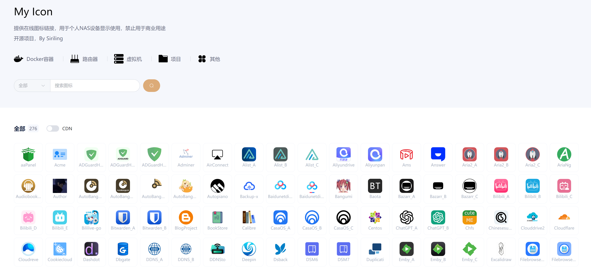

# My Icon


# 目录

[一、简介](#一简介)

[二、展示](#二链接)

[三、使用](#三使用)

[四、分类](#四分类)

[五、本地运行](#五本地运行)

[六、Docker部署](#六Docker部署)

# 一、简介

基于[Siriling/my-icons](https://github.com/Siriling/my-icons)&[heizicao/My Icon](https://gitee.com/heizicao/my-icon)修改，提供在线图标链接，用于个人NAS设备显示使用，禁止用于商业用途

# 二、展示

https://shigureui9.github.io/my-icons/




# 三、使用

- 点击相应图标即可获取URL

- 点击相应图标即可查看部署教程

- 打开CDN开关，可转换为CDN链接

# 四、分类
- Docker容器（docker）
- 路由器（router）
- 虚拟机（vms）
- 项目（project）
- 其他（other）

# 五、本地运行

下载安装node.js，在终端运行以下两个命令，然后在浏览器打开http://localhost:3005预览测试

```shell
npm install
npm run serve
```
待测试没问题之后，运行以下命令进行编译
```shell
npm run build 
```
编译后，会看到新增一个叫做dist的文件夹，里面就是编译后的文件, 直接将dist文件夹放到Nginx的www文件夹中即可
# 六、Docker部署
1. Docker部署Nginx服务
2. 下载本仓库
3. 进入my-icons文件夹
4. 运行编译命令
```shell
npm run build
```
5. 将dist文件夹放到Nginx的www文件夹中
6. 运行Nginx服务
```shell
docker run -d --name nginx -p 80:80 -v /www/my-icons/dist:/usr/share/nginx/html nginx
```
7. 打开浏览器访问http://localhost/即可测试


